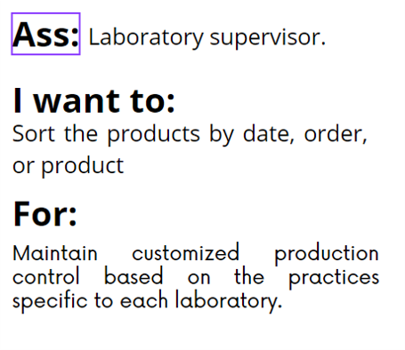
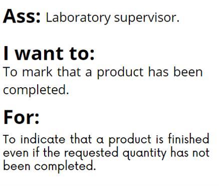
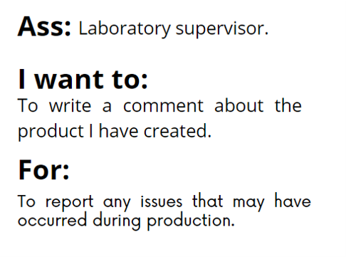
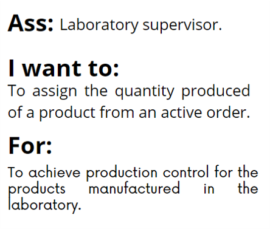

### Use cases.

**Actor:** worker
|Use case name|Description|Validations|
|-|-|-|
|Log in|The worker logs in with their own profile.|The system finds the profile. The system matches the profile with its corresponding password. The system validates the password |
|Manipulate the order view|The worker will be able to change the order of the orders list based on their priorities|The system's options for reordering the list will be based on the order's antiquity, the quantity of products in the order, and the order's deadline|
|Check orders|The worker can enter the order and review relevant information for their task, such as the deadline, quantity, and the current phase of the process|The system will display all relevant information when the worker wishes to access the order; this could be done through a window preview or by directly accessing the window order|
|Do tasks|The worker will be able to mark their finished goals in the corresponding task for the production process and then send the process to the next phase. For this feature, workers will have the ability to access workshops and laboratories|The system will provide the task goals to be marked. If the worker doesn't mark all the task goals, the system will prevent the shipment to the next phase|
|Report advances|The worker will have the ability to generate a resume, which will accompany the shipment to the next phase. This resume will contain details about the work performed and information about the product process or the product itsel|The system will allocate space for report generation, and it will have Markdown capabilities|

**Actor:** administrator
|Use case name|Description|Validations|
|-|-|-|
|Review product process|This feature will allow the administrator to review the database|The database it's available in the main program|

**Use cases diagram.**

## User stories.

  

  

  

  

