# Final documentation.

## Table of Contents:
  - Introduction.
  - Overall Objective and Specific Objectives.
  - Objectives achieved
  - Main features and functionalities
  - Relevance.
  - Functional requirements.
      - Use cases.
      - User stories.
  - Non-functional requirements.
  - Project priorities.
  - Class Diagrams.
      - Usage of classes in the requirements
      - Methodology used
  - Tests
  - User Manual

## Introduction.

To undertake an Object-Oriented Programming Project, several students from the Universidad Autónoma de Yucatán have embarked on a real-world endeavor within a company.
    
This particular project involves the transformation of an outdated accounting system into a modern one known as 'Comercial Pro.' This adaptable software leverages SQL to efficiently manage the company's data. For this specific company, which we will refer to as DN, there arose a need for an extension to oversee the various orders received daily.

DN specializes in selling a wide range of souvenirs to diverse companies. To facilitate these sales, they must first manufacture the products within their various laboratories, including the carpentry laboratory, sewing laboratory, serigraphy laboratory, and so forth. Finally, the project has been successfully concluded, resulting in a program that more effectively carries out the company's tasks and its database is also hosted on a server in the cloud. In this way we present the details in the following documentation:

  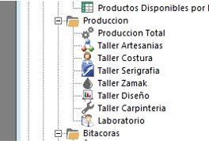

This feature was seamlessly integrated into the new software. However, it necessitated the installation of new computers in all the laboratories planning to utilize this functionality, alongside the acquisition of additional software licenses.

To address this challenge in a cost-effective manner, we proposed the implementation of a new project. This project revolves around the creation of a web-based platform serving as an interface for interaction between the laboratories and the administrative department. Consequently, laboratories can access the company's central database via the web, obviating the need for new computer installations.

## Overall Objective and Specific Objectives.
Throughout the development of the project, no objectives have been modified or added, so we emphasize those proposed from the very start.

The general objective of the project was to implement an agile administrative program to replace an already obsolete administrative system.
It turned out to be adaptable to the needs of the company. Using SQL database software to efficiently manage company data, presenting an HTML interface that can use Java commands for better database management. The project finally satisfies an administrative need of the DN company, which required an agile way to enhance its production processes.

The program finally uses a web-based platform that allows the use of the tools provided by the previous system but now with a more user-friendly interface, eliminating the need to purchase new equipment and licenses for the current software.
As an objective achieved, laboratories can now send notifications to the administrative department when the products have been finished and are ready for delivery.

The specific objectives of the project are as follows:

<ol>
  <li><strong>Create an HTML-formatted user interface:</strong> Develop an intuitive user interface using HTML that allows users to interact with the program effortlessly, minimizing the need for extensive training.</li>

  <li><strong>Ensure a well-organized class structure with sustainable development functions:</strong> Implement proper class and function organization within the software to enhance code quality and maintainability, ensuring the long-term sustainability of the project.</li>

  <li><strong>Implement database updates through efficient inserts and updates:</strong> Keep the database current by seamlessly incorporating data updates and inserts, ensuring the accurate representation of company information for informed decision-making.</li>

  <li><strong>Streamlining of Processes:</strong> The program will streamline the production system of DN company, enabling a more efficient and expedited execution of its processes.</li>

  <li><strong>Adaptability:</strong> The program will adapt to the production systems currently in place at DN company, ensuring a faster implementation process by seamlessly integrating with their existing infrastructure.</li>
</ol>

## Objectives achieved.

- 🆗**Create an HTML-formatted user interface: Develop an intuitive user interface using HTML that allows users to interact with the program effortlessly, minimizing the need for extensive training:** This interface was completed only for one laboratory, the rest were not achieved.
- ✔️ **Ensure a well-organized class structure with sustainable development features:** Proper organization of classes and features is implemented within the software to improve code quality and maintainability, ensuring the long-term sustainability of the project.
- ✔️**Implementation of database updates through efficient insertions and updates:** The database is kept up-to-date by seamlessly incorporating data updates and insertions, ensuring accurate representation of company information for informed decision making. In addition, it is presented with a shared cloud with H2
- ✔️**Process Streamlining:** The program meets the objective of streamlining the production system of the DN company, allowing for more efficient and agile execution of its processes.
- ✔️**Adaptability:** The program was able to adapt to the production systems with which it was already implemented in the DN company, ensuring a faster implementation process by integrating perfectly with its existing infrastructure.

## Main features and functionalities.
**1.- Laboratory Management:**
Creation and maintenance of profiles for each laboratory (carpentry, sewing, screen printing, etc.).

**2.- Centralized Database:**
- Centralized storage of information about products, inventory, suppliers, and orders.
- Access for all laboratories and the administrative department.

**3.- Intuitive Web Interface:**
User-friendly interface design for accessing and updating data from any laboratory or device with an internet connection.
Support for common browsers (Chrome and Edge).

**4.- Inventory Management:**
Automated tracking of raw materials and finished product inventory.

**5.- Production Logging:**
Functionality to log daily production for each laboratory.

**6.- Order Tracking:**

- Real-time tracking of order status, from request to delivery.
- Notifications for updates on order status.

**7.- Integration with Production Systems:**

- Connection with the production systems of each laboratory for automatic information updates.
- Establishment of standards for interoperability with existing technologies.

**8.- Scalability:**

- System design to allow expansion and addition of new laboratories in the future.
- Adoption of scalable technologies to handle company growth.

## Relevance.

The importance of the project revolves around the problem of efficiency, which is a real need in a real company. The real DN company sought to enhance both its administrative and productive processes. To achieve this, the company has been exploring ways to optimize its operations by implementing accounting software solutions, aimed at alleviating the current workload challenges facing the company. That is why, in addition to being a school-related project, all the processes, coding and documentation carried out in this project were already implemented in the real world.

Additionally, the level of this project helps us in the future to demonstrate to companies how the experience we have acquired (mostly related to Java coding, HTML, SQL and the development process) is used in this implementation.

## Functional requirements.

|id|requirement name|description|observations|
|--|----------------|-----------|------------|
|RF001|Log in|If the program is being opened for the first time or if the user has closed their session, it will prompt for authentication with a profile and password|When opening the application without an active session, the system will display the login interface|
|RF002|User Verification|Upon entering the program, users will be prompted to enter a predefined username and password stored in the database. Users must provide the correct combination of username and password to access the program.|
|RF003|Main interface|The program will allow the worker to review tools and information, such as the laboratories they belong too|Each profile will have its own workshops based on the section or type of worker|
|RF004|Orders list|The main interface will allow workers to review their tasks and orders, including the delivery deadline for each product, the quantity of products, and the assignment date of the task|The main interface should prioritize clarity and user-friendliness to ensure that workers can easily access and comprehend the information related to their tasks and orders. This includes prominently displaying critical details such as the delivery deadlines for each product, product quantities, and task assignment dates. Additionally, it's essential to implement an intuitive navigation system that enables efficient task and order management|
|RF005|Manipulate the orders list|The system allows users to manipulate the orders list, including adding, updating|The system's ability to manipulate the orders list by allowing users to perform actions such as adding and updating that is a crucial feature for enhancing order management flexibility. It is essential to ensure that these operations are well-documented, easily accessible, and include appropriate validation checks to prevent errors. Furthermore, user permissions and access control should be considered to maintain data integrity and security while interacting with the orders list|
|RF006|Review tasks|The 'Review Tasks' function allows users to examine and manage tasks associated with orders, including viewing their status, tracking progress, and making updates when necessary|The 'Review Tasks' function is a valuable tool for users to inspect and oversee tasks related to orders. To enhance its effectiveness, it is essential to design this function with a user-friendly interface that allows for intuitive navigation. The ability to view task statuses, track progress, and make updates when necessary is pivotal for efficient task management. Consider implementing clear visual cues, such as status indicators, to provide users with immediate insights into the state of each task. Furthermore, ensuring that the 'Review Tasks' function integrates seamlessly with other system features can streamline overall order and task management|
|RF007|Complet the tasks|The 'Complete the Tasks' functionality allows users to mark a task as completed, triggering the order to proceed to its next phase in the production process|The 'Complete the Tasks' functionality is a critical component that empowers users to signify task completion, thus advancing the associated order to the subsequent phase of the production process. To ensure seamless workflow management, it's crucial to design this functionality with simplicity and efficiency in mind. Consider incorporating clear and intuitive controls that enable users to mark tasks as completed effortlessly. Furthermore, implementing validation checks to confirm task fulfillment before progression can help maintain order accuracy and integrity within the production process. Additionally, clear notifications or status updates should inform users about the transition of orders to their next phases, providing transparency and clarity in the production workflow|
|RF008|Generate report advances|The 'Generate Report Advances' feature empowers users to create specific or comprehensive reports about orders and their work progress within their part of the process. These reports can encompass product details and any identified defects during the production process|Report generation will be an optional feature of the system|
|RF009|Check users list|The users would see their name on the web to verify that they are using their account.|This option can be any user.|
|RF010|Changes|A bar that notificates the new changes|This option will help the user to see if ther is new orders to produce.|
|RF011|Check produtc by date, name, etc.|An option to view the products by new, oldest, done, not done, name, date|This kind of list can be seen for anyone.|

### Use cases.

**Actor:** worker
|Use case name|Description|Validations|
|-|-|-|
|Log in|The worker logs in with their own profile.|The system finds the profile. The system matches the profile with its corresponding password. The system validates the password |
|Manipulate the order view|The worker will be able to change the order of the orders list based on their priorities|The system's options for reordering the list will be based on the order's antiquity, the quantity of products in the order, and the order's deadline|
|Check orders|The worker can enter the order and review relevant information for their task, such as the deadline, quantity, and the current phase of the process|The system will display all relevant information when the worker wishes to access the order; this could be done through a window preview or by directly accessing the window order|
|Do tasks|The worker will be able to mark their finished goals in the corresponding task for the production process and then send the process to the next phase. For this feature, workers will have the ability to access workshops and laboratories|The system will provide the task goals to be marked. If the worker doesn't mark all the task goals, the system will prevent the shipment to the next phase|
|Report advances|The worker will have the ability to generate a resume, which will accompany the shipment to the next phase. This resume will contain details about the work performed and information about the product process or the product itsel|The system will allocate space for report generation, and it will have Markdown capabilities|

**Actor:** administrator
|Use case name|Description|Validations|
|-|-|-|
|Review product process|This feature will allow the administrator to review the database|The database it's available in the main program|

**Use cases diagram.**

## User stories.

  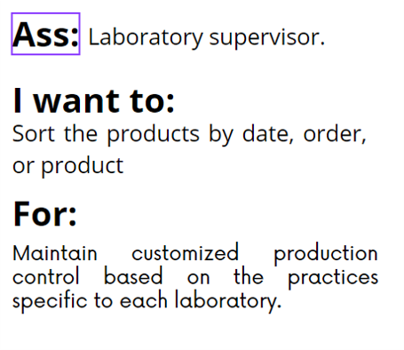

  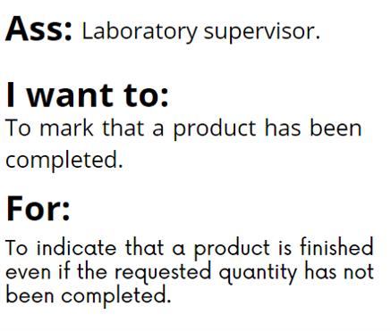

  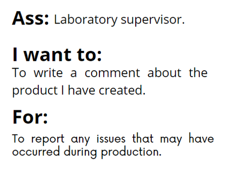

  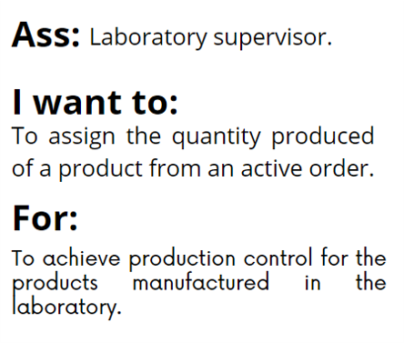

## Non-functional requirements.

As part of non-functional requirements, we were able to meet the ones proposed at the beginning of the project.

### Security

Security is defined as the way in which the system is protected with the data it contains to prevent loss or data breaches from unauthorized sources.
| Requeriment | Name | Description |
|--------------|--------------|--------------|
| **RNF 1** | Authentication | All users are authenticated to log in and use the system. There is a username and password. |
| **RNF 2**  | Multiple sessions  | The system does not restrict multiple sessions opened in the browser or workstation with the same user.   |
| **RNF 3** | Maintain login | The system maintains the user's login in case of web server failures. |

### Availability

The time in which the system is functional and working.
| Requeriment | Name | Description |
|--------------|--------------|--------------|
| **RNF 4** | High availability | The system is available when the user likes to use it. This quality scenario is met by the infrastructure and deployment proposal presented.  |

### Reliability

It refers to the level of confidence that the system offers not to fail in the execution of its function.
| Requeriment | Name | Description |
|--------------|--------------|--------------|
| **RNF 5** |As long as the database is available, data loss does not exist in the system. In case of interruptions in communication between the servers and the client, the system does not continue with the request and the client must resume the request.  |

### Portability

The system's ability to run on different technological platforms.
| Requeriment | Name | Description |
|--------------|--------------|--------------|
| **RNF 6** | Browser | The web system is compatible with computers with the goal of providing a consistent and accessible user experience on all these platforms. |

### Flexibility

The software can adapt to changing situations and supports changes in business policies and rules.
| Requeriment | Name | Description |
|--------------|--------------|--------------|
| **RNF 7** |There is a scheme to manage specific configuration properties of the resources used by the application. For example, the name of the database. |

## Project priorities.

For a successful program implementation, it is required to have a development schedule, through which the most crucial functions required by the software are evaluated. To achieve this, an administrative meeting was conducted involving developers, company administrators, and the employees who will be using the software upon its development. 

During the meeting, agreements were reached, and it was determined that the most pressing need was communication between the laboratories and the administration. As a result, a high priority will be given to the communication between the laboratory and the database, as well as the communication from the database to the laboratory.

## Class Diagrams

For the organization and development of this project, we will divide the necessary functionalities into different classes that aid in the implementation and maintenance of the software. To accomplish this, we will utilize the Java programming language, allowing us to implement the requirements more efficiently.

  

This implementation of classes and interfaces will enable us to achieve our objectives and requirements with respect to the software. It is divided in such a way that it allows for the proper functioning of the software, making it easier to maintain, more user-friendly for the programmer, and straightforward to modify.

## Usage of classes in the requirements

For a better visualization of requirement fulfillment, the following table displays the relationship between the class and the requirement it satisfies.

| Class                                              | Functional requirement it satisfies  |
|----------------------------------------------------|-------------------------------------|
| 
 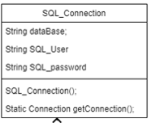
 | RNF2, RNF3, RNF5                   |
| 
 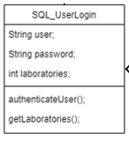
 | RF1, RF2, RF9, RNF1                 |
| 
 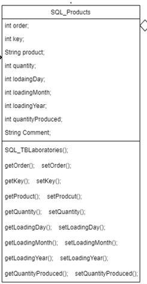
 | RNF7                                |
| 
 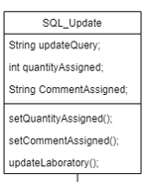
 | RF5, RF7, RF8                       |
| 
 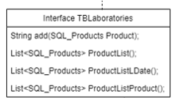
 | RF3, RF4, RF6, RF9, RF10, RF11      |
| 
 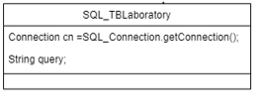
 | RF3, RF4, RF6, RF9, RF10, RF11      |

## Tests

## User Manual
